# Architecture Framework: AIP + ADR

Este framework combina o conceito de propostas de melhoria de arquitetura (AIPs) com registros formais de decisões (ADRs).

## Visão Geral

- **AIP**: Architecture Improvement Proposal
- **ADR**: Architecture Decision Record

## Como usar

1. Crie uma nova AIP a partir do template.
2. Revise colaborativamente.
3. Quando decidido, registre como ADR.

## Estrutura

~~~
architecture-framework/
├── aip/ # Propostas
├── adr/ # Decisões tomadas
├── templates/ # Modelos
~~~

🔶 Requisito obrigatório:
Cada AIP deve conter ao menos um desenho da solução proposta, em formato .drawio (ou .svg, .png exportado do Draw.io).
O arquivo deve ser salvo no mesmo diretório do AIP, com o nome:

~~~
aip/AIP-XXXX/
├── AIP-XXXX.md
└── AIP-XXXX.drawio
~~~

## Boas práticas para diagramas

- Utilize [draw.io](https://draw.io/) (gratuito, exportável para Git)
- Representar sistemas, fluxos de dados, integrações, e decisões arquiteturais
- Nomeie os elementos de forma clara e concisa
- Use versões e datas nos arquivos, se aplicável

```mermaid
flowchart LR
    Start[Proposta de Arquitetura] --> AIP
    AIP --> Discussao[Discussão e Revisão]
    Discussao -->|Aprovado| ADR
    Discussao -->|Rejeitado| Encerrado
```

